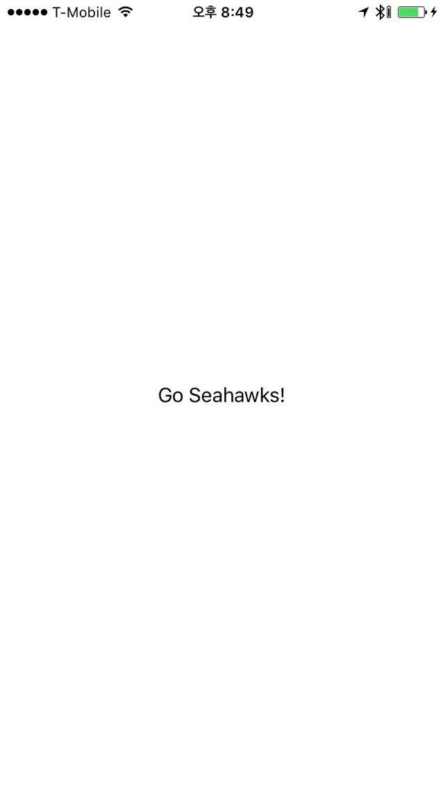

# Hello iOS!

This assignment was locked Mar 31 at 6:30pm.
Create a scaffolded-out iOS application
Target to iOS iPhone 5
Change the "Hello World!" text to "Go Seahawks!"
or "Go Dawgs!"
or "Cougars suck!"
Change the displayed name of the app to "Hello"
Ensure it builds correctly
Ensure it runs inside the emulator
Ensure it runs on an iOS device
Check it in on your GitHub account

